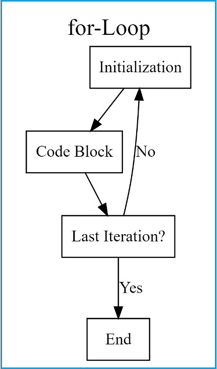

[Brynleigh Github](https://github.com/bep0022/PLPA5820)

This exercise is based partially on the data and iterations presented here:
https://github.com/noelzach/fungalEC/blob/master/DoseResponseAnalysis.md

The data this analysis performs is published here: https://apsjournals.apsnet.org/doi/full/10.1094/PDIS-06-17-0873-SR 

In this exercise we will explore ways of iteration in R and writing functions. 

These are not exactly straight forward to learn and can be challenging, but once mastered you will start seeing data differently, and you will start to realize that thousands, hundreds of thousands, or even millions of datapoints are manageable. 

You will need the following packages for this excersize. 
```{r}
library(ggplot2)
#install.packages("drc")
library(drc) 
library(tidyverse)
library(dplyr)
```

# Functions
Functions are like those written into packages. They are useful when you need to perform the same code on different data and you want to avoid copy and paste errors. 

If you find yourself coding and you keep copy and pasting certain code. Maybe its time to convert it to a function. 

Functions are useful to simplify your code, and make your data management as reproducible as possible. 

Lets show an example

Say I wanted to make a function to convert Fahrenheit to Celsius

The formula is

$$
(ºF - 32) * \frac{5}{9}
$$
I could write it in R like this, where degree_f = our degrees in Fahrenheit I want to convert
```{r, eval=F}
(5*(degree_f - 32)/9)
```

So if we input 32 degrees Fahrenheit that would equal 0
```{r}
# (5*(32 - 32)/9)
(5*(32 - 32)/9)
```

But now we want to input a different number, say 80ºF and we have to copy and paste the formula below or overwrite what we just wrote. This is not very reproducible because it is susceptible to copy and paste errors, and not remembering what we did if we overwrite previous code. 
```{r}
# (5*(80 - 32)/9)
(5*(80 - 32)/9)
```

We can solve this by converting it to a function. 
Note: To write a function, use "function."
  (the input for the function, in this case fahrenheit_temp)
  {anything you want to do in the function, in this case the farenheit temp calculation}
  Return is the output, in this case celsius
```{r}
F_to_C <- function(fahrenheit_temp){
  celsius <- (5*(fahrenheit_temp - 32)/9)
  return(celsius)
}

# these do the same thing
F_to_C(32)
```

Now that wasn't super complicated to write. But we can get much more complex and our variable can be whole datasets or columns within datasets. 

# Anatomy of a function 

We first start with naming the function something using the backwards arrow. Then we type "function()". 

After opening a new function we type the curly brackets. We will type the code we want to perform within the curly brackets. 

Inside the parentheses after function is where we put our variables separated by commas. 
```{r, eval=F}
sample.function <- function(... variable goes here ...){
  .... code goes here.... 
  return(... output ...)
}
```

*So, in the example above we want to put the variable inside the parentheses. This is what we are going to input into the function. 
*Then we input what we want to do to the variable inside the brackets  
*Then all functions need a return() -  this is what we want the output of the function to be 

Make sense? 

# Now you try

####### Write a function to convert celsius to fahrenheiht using the conversion of F = C x (9/5)+32
```{r}
C_to_F <- function(celsius){
  fahrenheit_temp <- (celsius*(9/5)+32)
  return(fahrenheit_temp)
}

C_to_F(32)
```

# More complicated function usage - Did not see a video?

Lets use a function to return multiple R elements. We can do this to return different R objects such as a dataframe, a ggplot, and others. 

In this example we are going to write a function to do perform a specific test on multiple variables within a dataset and generate a plot for them. 

```{r}

```

# Iterations

Iterations are something you do over and over again. They are useful for multiple reasons. In terms of reproducibility, it again, helps reduce copy and paste errors for something we would like to do over and over again. It can also helpful for sanity checks through data simulation. 

In this example we will cover iterations in the following functions
*rep()
*seq() & seq_along()
*for loops 
*map()
*nested map()

#### the rep() function

The rep() function allows you to repeat elements easily 
```{r}
rep("A", 3) # repeats A three times 
rep(c("A", "B"), 5) # repeats A and B, times 
rep(c(1,2,3,4), times = 4) # repeats 1,2,3,4, 4 times 
rep(c(1,2,5,2), times = 4, each = 4) # repeats 1 four times, 2 four times, 5 four times, and 2 four times. 
```

The seq() command allows you to write sequences of numbers easily
```{r}
seq(from = 1, to = 7) # sequence of numbers 1 to 7
seq(from = 0, to = 10, by = 2) # sequence of numbers from 0 to 10 by 2s 

# combined seq() and rep()
rep(seq(from = 0, to = 10, by = 2), times = 3, each = 2)
```

The seq_along() function allows you to generate a sequence of numbers based on non-integer (character) values. This will become very useful when we want to loop over elements within a dataframe. 
Note: Good for looping by character vector
```{r}
# use the built in LETTERS vector for an example. 
LETTERS # the alphabet built in R
seq_along(LETTERS[1:5]) # will return 1,2,3,4,5 not the actual letters. 
```

# The for loop

The for loop is classic coding. Almost every coding language has a version of a for loop.

It is based on the following algorithm:
```{r}
#
```

Lets see a very basic example of how a for loop works

```{r}
for (i in 1:10) {
print(i*2)  
}
```
Describe in your own words what is happening. 
Note:
  i denotes each value in the sequence 1-10 (does not matter which letter, could be x or y)
  type code in {}
  for each value in 1-10, multuply by 2 and print it to the console
  
lets see a more complicated example where we subset a dataset based on isolate within our fungicide sensitivity dataset and we perform a function on it and extract some results. 

# Combining functions and for loops
for loop using the F_to_C function we created
```{r}
for (i in -30:100){
  result <- F_to_C(i)
  print(result)
}
```
This was great, but this only printed to the console, and we cannot really do anything with those values. What if we wanted to do something with the result of the iteration?

Step 1. Set a R object to NULL

Step 2. Set your for loop

Step 3. Save the result of your for loop into a dataframe each iteration

Step 4. append one row of the dataframe to the null object each iteration of the loop.

```{r}
celcius.df <- NULL # Set R object as NULL, for future variable
for (i in -30:100){   
result_i <- data.frame(F_to_C(i), i)   # Save a one row data frame for each iteration
celcius.df <- rbind.data.frame(celcius.df, result_i) # Row binding each iteration to the data frame
}
```


